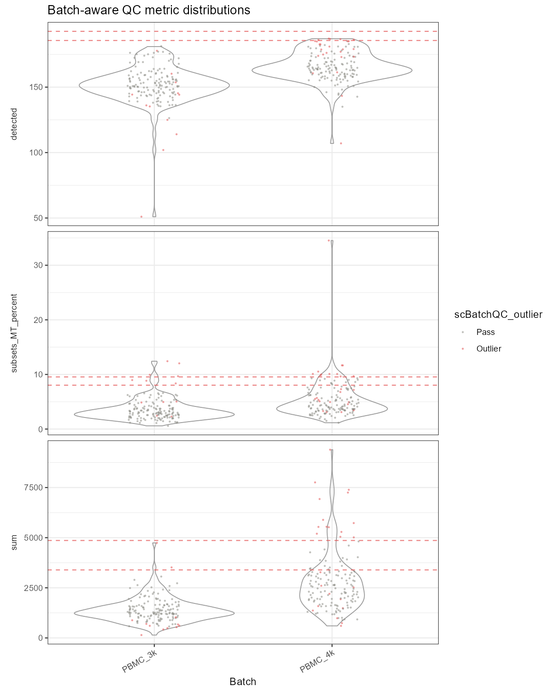

# scBatchQC

<!-- badges -->
[](https://github.com/SubhadipJana1409/scBatchQC/actions)
[](https://opensource.org/licenses/MIT)

## Overview

**scBatchQC** provides a hierarchical empirical Bayes framework
for quality control in multi-sample, multi-batch single-cell
RNA-seq (scRNA-seq) experiments.

Most existing QC tools apply a single global MAD-based threshold
across all cells — ignoring the fact that library size
distributions, mitochondrial fractions, and doublet rates differ
systematically across batches. This leads to **over-filtering of
low-depth batches** and **under-filtering of high-depth ones**.

`scBatchQC` solves this by:

- Estimating per-batch QC metric distributions (median + MAD)
- Shrinking per-batch estimates toward a global empirical Bayes
  prior
- Modeling per-batch doublet rates from cells-loaded metadata
  and protocol type
- Returning a `SingleCellExperiment` with calibrated QC flags
  in `colData`

## The problem scBatchQC solves

<p align="center">
  
</p>

## Installation

```r
# Install from Bioconductor (once accepted)
if (!requireNamespace("BiocManager", quietly = TRUE)) {
    install.packages("BiocManager")
}
BiocManager::install("scBatchQC")

# Or install the development version from GitHub
BiocManager::install("SubhadipJana1409/scBatchQC")
```

## Quick start with real PBMC data

The package ships a subset of real PBMC data from
[Zheng et al. (2017)](https://doi.org/10.1038/ncomms14049)
in `inst/extdata/pbmc_small.rds` (193 genes × 300 cells,
two batches: PBMC\_3k and PBMC\_4k).

```r
library(scBatchQC)
library(SingleCellExperiment)

# Load the bundled real PBMC data
sce <- readRDS(system.file("extdata", "pbmc_small.rds",
                           package = "scBatchQC"))

# Step 1: batch-aware QC flagging
sce <- batchAwareQCMetrics(sce, batch = "batch", nmads = 3)

# Step 2: estimate doublet rates
cells_loaded <- c(PBMC_3k = 6000, PBMC_4k = 8000)
sce <- estimateBatchDoubletRate(
    sce,
    batch = "batch",
    cells_loaded = cells_loaded
)

# Step 3: visualise
plotBatchQC(sce, batch = "batch")

# Step 4: filter
sce_filtered <- sce[, !sce$scBatchQC_outlier]
```

## Key functions

| Function | Description |
|---|---|
| `batchAwareQCMetrics()` | Per-cell QC with hierarchical MAD thresholds |
| `estimateBatchDoubletRate()` | Per-batch doublet rate modelling |
| `harmonizeQCThresholds()` | Interactive threshold exploration |
| `plotBatchQC()` | QC distribution violin plots per batch |
| `BQCResult` | S4 container for batch QC results |
| `qcFlags()` | Accessor: extract QC flag DataFrame from BQCResult |
| `doubletScores()` | Accessor: extract doublet scores from BQCResult |
| `batchSummary()` | Accessor: extract per-batch summary from BQCResult |

## How the shrinkage works

For each QC metric and batch, `scBatchQC` estimates:

1. Per-batch median and MAD
2. A global prior pooled across batches (weighted by √n)
3. A shrinkage-adjusted threshold:

```
threshold_b = shrunk_median_b + nmads × shrunk_MAD_b
```

where `shrunk = (1 - s) × per_batch + s × global_prior`
and `s` is the `shrink_strength` parameter (default 0.5).

| `shrink_strength` | Behaviour |
|---|---|
| 0 | Fully per-batch (no pooling) |
| 0.5 | Balanced (default) |
| 1 | Fully pooled (ignores batch) |

## Example output

Tested on real PBMC data from
[Zheng et al. (2017)](https://doi.org/10.1038/ncomms14049)
via `TENxPBMCData` (193 genes × 300 cells, 2 batches):

### QC distributions per batch

<p align="center">
  
</p>

*Violin plots of library size, genes detected, and mitochondrial
fraction per batch. Dashed red lines = batch-harmonised thresholds.
Red points = flagged outlier cells.*

### Console summary

```
Outlier cells per batch:
        PBMC_3k PBMC_4k
FALSE       138     125
TRUE         12      25

Estimated doublet rates:
PBMC_3k PBMC_4k
  0.045   0.060

Threshold sweep (nmads):
  nmads = 2.0 -> 87 cells flagged
  nmads = 2.5 -> 51 cells flagged
  nmads = 3.0 -> 38 cells flagged
  nmads = 3.5 -> 25 cells flagged
  nmads = 4.0 -> 17 cells flagged

After filtering: 263 / 300 cells retained (12.3% removed)
```

## Example data

The package includes a subset of real PBMC single-cell RNA-seq
data for demonstrations and testing:

| File | Description |
|---|---|
| `inst/extdata/pbmc_small.rds` | 193 genes × 300 cells, 2 batches (PBMC 3k + 4k) |
| `inst/scripts/make_example_data.R` | Provenance script documenting how the data was obtained |
| `inst/scripts/run_full_demo.R` | End-to-end demo exercising all package functions |

**Data source**: Zheng GXY et al. (2017). Massively parallel
digital transcriptional profiling of single cells.
*Nature Communications*, 8:14049.
[doi:10.1038/ncomms14049](https://doi.org/10.1038/ncomms14049)

To run the full demo:

```r
# From the package root
source(system.file("scripts", "run_full_demo.R",
                   package = "scBatchQC"))
```

## Citation

If you use `scBatchQC` in your research, please cite:

```r
citation("scBatchQC")
```

> Jana S (2026). scBatchQC: Batch-Aware Cell Quality Control
> for Single-Cell RNA-seq. R package version 0.99.0.
> https://github.com/SubhadipJana1409/scBatchQC

## Contributing

Bug reports and feature requests are welcome at
https://github.com/SubhadipJana1409/scBatchQC/issues

## License

MIT © Subhadip Jana
